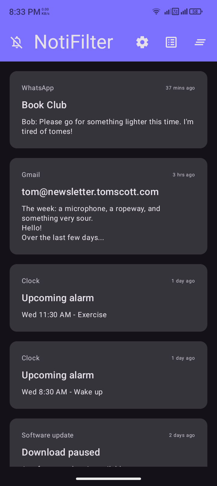
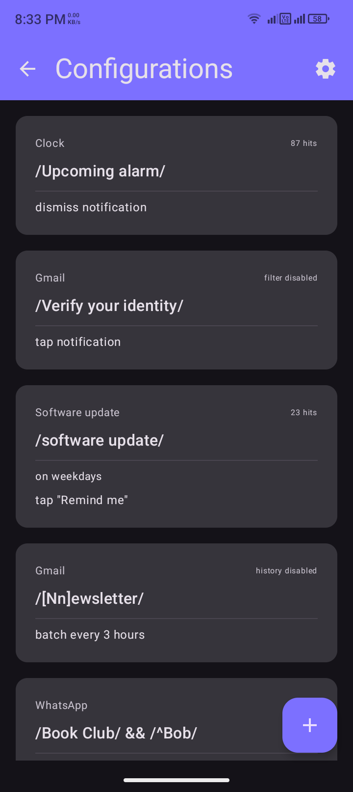

# NotiFilter (Fork)

**Silence annoying notifications, stay in control.**

NotiFilter is a powerful, privacy-focused notification manager that listens to all device notifications and quietly manages those that match your custom filters. This fork introduces several advanced features to make your notification history more interactive and useful.

## What's New in This Fork?

This version (v5.0.0+) builds upon the original NotiFilter with several powerful additions:

- **Actionable History** - Don't just block notifications; interact with them. You can now tap on any blocked notification in the history screen to open the original app or trigger the intended action.
- **Scheduled Summaries** - Instead of getting distracted throughout the day, receive a "Digest" of all blocked notifications at your preferred times (e.g., morning and evening).
- **Modern Interactions** - Smooth, bidirectional swipe-to-delete gestures in the History screen with fluid animations.
- **UI Refinements** - Clean, system-native typography and improved status bar icons for better visibility.
- **Persistence** - Improved reliability with auto-resume after device reboots.

## Features

- **Filters** - Use [regex](https://github.com/estiaksoyeb/NotiFilter/wiki/Examples) to precisely target annoying notifications from each app 🎯
- **Actions** - Choose exactly what happens:
    1. Dismiss it 🚫
    2. Tap it ✅
    3. Tap a button 🔽️
    4. Delay it ⏳
    5. Collect into batches 📦
    6. Debounce it ❄
    7. Mute it 🔇
    8. Play an alert 🔔
- **Summaries** - Get a consolidate notification of blocked items at scheduled intervals 🗞️
- **Schedule** - Choose when filters run (e.g., only during work hours) ⏰
- **History** - Recently dismissed notifications are stored locally with "Click-to-Open" support 😉
- **Export/Import** - Backup or transfer your filters **and** summary schedules as JSON files 📂
- **Free, open-source & private**
    - No ads, trackers, or internet access 🆓
    - Licensed under the [GPLv3](LICENSE) 📃
    - Fully offline; your data never leaves your device 🔐

## Screenshots

 

## Installation

1. Download the latest APK from the [Releases](https://github.com/estiaksoyeb/NotiFilter/releases) section.
2. Or use **Obtainium** to stay updated directly from this repository.

*Note: This fork uses the package name `com.estiaksoyeb.notifilter`, so it can be installed alongside the original app.*

## Credits

- Original app developed by [BURG3R5](https://github.com/BURG3R5/NotiFilter).
- Fork enhancements by [estiaksoyeb](https://github.com/estiaksoyeb).
